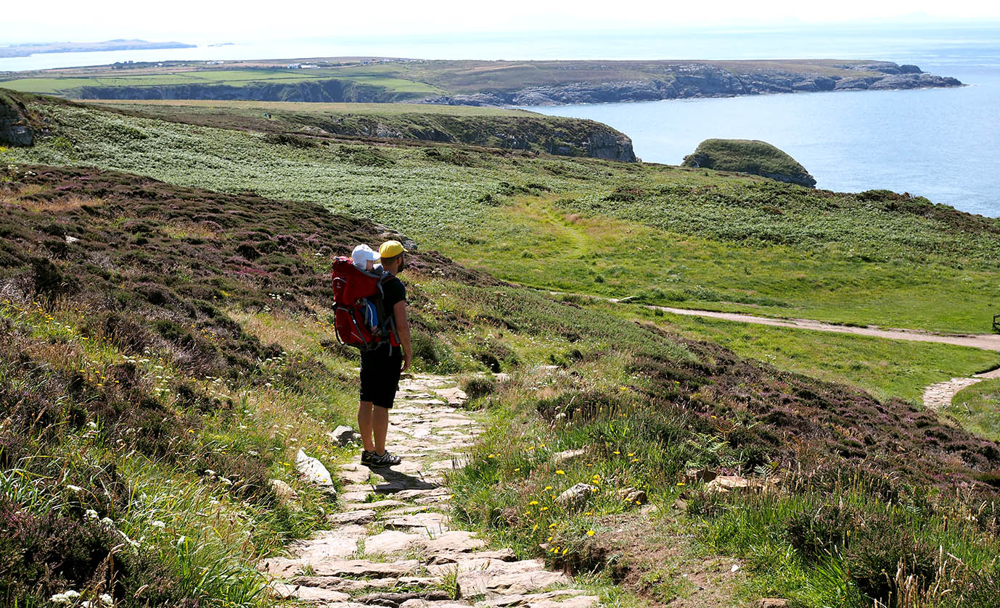

I am a full stack software engineer with a lot of knowledge and experience in the field of software architecture, CI, CD, web development and web API's. I work and live in Amsterdam, the Netherlands. I have worked for many years for Stater, a big fintech company delivering software for the mortgage industry. Recently I switched jobs and I now work for eTender, a small startup with a reservation system for restaurants. In this blog I write about .NET Core, web development, REST API's and software architecture.

